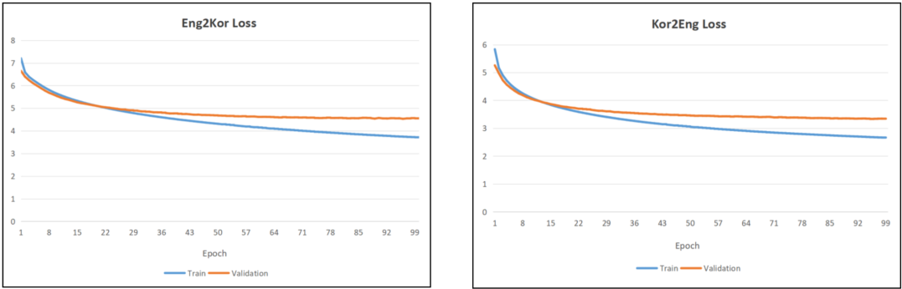

# eng-kor-transformer
Inspired by Kpop (I'm a ONCE 🍭) and the emergence of ChatGPT, I decided to build a Transformer **from scratch** for **English-Korean machine translation**, 
following [Attention is all you need](https://arxiv.org/pdf/1706.03762) paper.


### Dataset
Ideally, a clean English–Korean parallel corpus can be obtained from [AI Hub](https://www.aihub.or.kr/). However, account creation is restricted to users within Korea. 
As a result, two alternative datasets were considered:
1. A small but clean dataset from [Huffon/pytorch-transformer-kor-eng](https://github.com/Huffon/pytorch-transformer-kor-eng/tree/master/data) which is used
   in this project.
2. A large but noisy dataset from [OPUS-Corpora](https://opus.nlpl.eu/).

The size of training & testing datasets are as follow:
- Training: 92,000 sentences
- Testing: 11,500 sentences

### Requirements

```
pyyaml==6.0.3
sentencepiece==0.2.0
sacrebleu==2.5.1
torch==2.6.0
```

### Tokenizer
This project uses [sentencepiece](https://github.com/google/sentencepiece) unigram model which selects subwords with highest likelihood.

To build your own tokenizer, please run `.\02_src\build_tokenizer.py`. The parameters for tokenizer can be modified at `02_src\config.yaml`.

You might need to change input file names, the structure of these files should be similar to those in `01_data\sentencepiece`.

```python
build_tokenizer_model(
    Language.KOR, 
    os.path.join(SENTENCE_PIECE_DATA, "{}.txt".format('korean')) # IMPORTANT: Replace this filename with yours
)
```

Sentences are segmented into subword units defined in the `.vocab` file, while the trained tokenizer itself is stored in the `.model` file.

### Training, testing & translating
Like many other AI enthusiast, I did not have access to a local GPU and Google Colab limits sessions to several hours. So I used [Kaggle](https://www.kaggle.com/)
to train my models, which provides **30 hrs/week of free GPU**.

All scripts related to training/testing can be found in `02_src\kor2eng-v1.ipynb`.

To run this notebook, please change the input & output file destinations.

```python
SENTENCE_PIECE_DATA = '/kaggle/input/korean-sentencepiece/sentencepiece' # IMPORTANT: Tokenizers & data directory

# IMPORTANT: Change tokenizer's filename 
ENG_MODEL_PATH = os.path.join(SENTENCE_PIECE_DATA,'english_unigram.model') 
KOR_MODEL_PATH = os.path.join(SENTENCE_PIECE_DATA,'korean_unigram.model')

# IMPORTANT: Change training/testing data filename
train_korean  = os.path.join(SENTENCE_PIECE_DATA, 'korean.txt') 
train_english = os.path.join(SENTENCE_PIECE_DATA, 'english.txt')
test_korean   = os.path.join(SENTENCE_PIECE_DATA, 'test_korean.txt')
test_english  = os.path.join(SENTENCE_PIECE_DATA, 'test_english.txt')
```

### Results


Although the convergence rate for both directions are similar, the lowest validation loss of the KOR → ENG is **3.3341** compared to **4.5607** by that 
of ENG → KOR which is consistent with the BLEU scores in the table below.

|From Language| ENG | KOR |
| ----------- | --- | --- |
| BLEU        |9.32| 24.03 |

It can be seen that the BLEU score for **KOR → ENG (24.03)** is much higher than for **ENG → KOR (9.32)**, likely due to linguistic asymmetry. In particular, when 
translating from English to Korean, the model must infer honorifics that are explicitly encoded in Korean but largely absent in English leading to lower BLEU score. For example:
- 저는 학생입니다. (formal)
- 저는 학생이에요.

carry the same meaning but differ in level of politeness. Below are sample translations from my trained models:

**1. ENG -> KOR**
```
SRC: I am going home tomorrow.
TRG: 내일 집에 갈 거예요.
```

**2. KOR -> ENG**
```
SRC: 저는 내일 집에 갑니다.
TRG: Tomorrow, I am going to go home.
```

### References
- [SamLynnEvans/Transformer](https://github.com/SamLynnEvans/Transformer)
- [Huffon/pytorch-transformer-kor-eng](https://github.com/Huffon/pytorch-transformer-kor-eng)
- A great [playground](https://poloclub.github.io/transformer-explainer/) explaining how Transformer works.
